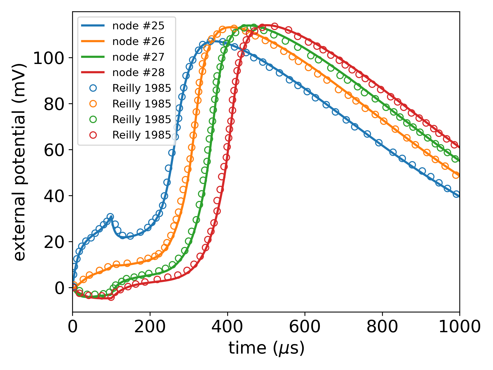
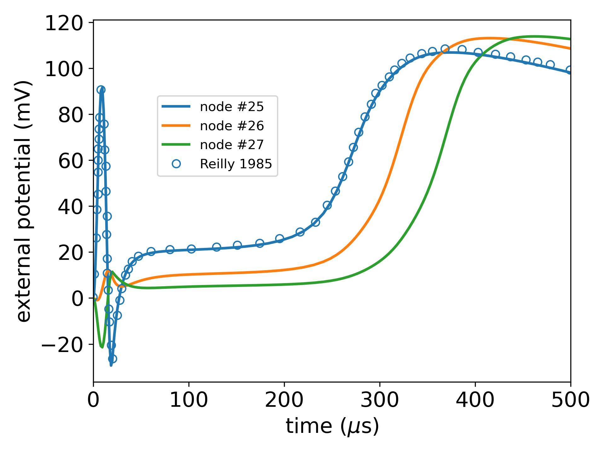

# SENN

This repository includes a python implementation of the Spatially Extended Nonlinear Node (SENN) model [1,2,3]. At the time of writing the original SENN model is provided as a Fortran code [4]. This project is not a one-to-one conversion of the Frotran code to a Python code. The Python SENN model is based mainly on references [1,2,3] and it is developed from scratch. 

## 1. Validation of the Python-SENN model

To validate the proposed Python-SENN model some simulations are carried out considering two kind of stimuli: a _monophasic square pulse_ and a _one cycle sinusoidal pulse_.

### 1.1 Monophasic square pulse

#### 1.1.1 Computation of the Threshold - comparison with Fortran SENN

In this section the Python-SENN model is compared with the results obtained with the Fortran-SENN model. The perception threshold is computed with both model considering:

* 51 nodes (all non-linear)
* single electrode excitation 2 mm above the central node (25th nodes with 0-based numbering)

Computations are performed by varying the duration of the pulse. Results are summarized in the table below. Deviation is always lower than 1%.

| Duration (us) | Python SENN (mA) | Fortran SENN (mA) | deviation (%) |
|---------------|------------------|-------------------|---------------|
| 50            | 0.996875         | 0.987500          | 0.95          |
| 100           | 0.679004         | 0.679700          | 0.10          |
| 150           | 0.567578         | 0.570300          | 0.48          |
| 200           | 0.509473         | 0.507800          | 0.33          |
| 250           | 0.474609         | 0.472700          | 0.40          |
| 300           | 0.448633         | 0.449200          | 0.13          |
| 350           | 0.430859         | 0.431300          | 0.10          |
| 400           | 0.419922         | 0.418000          | 0.46          |
| 450           | 0.408984         | 0.406200          | 0.69          |
| 500           | 0.399414         | 0.398400          | 0.25          |

#### 1.1.2 Computation of the transmembrane voltage, comparison with Fortran SENN model

The transmembrane voltages at the nodes where the action potential is initiated and at some closer nodes is computed with both Python-SENN model and Fortran-SENN model. In this case, we consider:
* 51 nodes (all non-linear)
* computation of the transmembrane potential at
    * node 25 (i.e., with a 0-based numbering, the central one)
    * node 26
    * node 27
* duration: 100 us
* magnitude:
    * Python SENN: 0.681 mA
    * Fortran SENN: 0.68 mA

It is necessary a small difference (0.681 A vs 0.68 A) in the magnitude of the stimulus for a perfect overlap the curves. Likely for some difference in the solution of the differential equations of the model. Results are shown in Figure 1.

<b>Figure 1</b>: Python SENN (lines) vs Fortran SENN (markers)

#### 1.1.3 Computation of the transmembrane voltage, comparison with literature

The transmembrane voltages at the nodes where the action potential is initiated and at some closer nodes is computed. Transmembrane voltages are compared with the ones provided in [1, Fig2].

Reference [1] does not provide details about the complete setting of the SENN models, therefore a configuration that best fits the literature results have been identified:
* 51 nodes
* non-linear nodes from 25 to 32
* duration: 100 us
* magnitude: 0.682 mA

Transmembrane voltages at nodes from 25 to 28 are available in [1], data are digitalized by means of [PyDigitizer](https://github.com/giaccone/PyDigitizer) and compared with the results obtained by means of the Python-SENN model. The comparison is shown in Figure 2.

<b>Figure 2</b>: Python SENN (lines) vs Literature (markers)

### 1.2 One cycle sinusoidal pulse

#### 1.2.1 Computation of the Threshold - comparison with Fortran SENN

In this section the Python-SENN model is compared with the results obtained with the Fortran-SENN model. The perception threshold is computed with both model considering:

* 51 nodes (all non-linear)
* single electrode excitation 2 mm above the central node (25th nodes with 0-based numbering)

Computations are performed by varying the frequency of sinusoidal pulse. Results are summarized in the table below. Deviation is always lower than 1%.

| Frequency (kHz) | Duration (us) | Python SENN (mA) | Fortran SENN (mA) | deviation (%) |
|-----------------|---------------|------------------|-------------------|---------------|
| 50.000          | 20            | 9.075000         | 9.125000          | 0.55          |
| 25.000          | 40            | 3.925000         | 3.906200          | 0.48          |
| 16.667          | 60            | 2.575000         | 2.593800          | 0.72          |
| 12.500          | 80            | 1.968750         | 1.953100          | 0.80          |
| 10.000          | 100           | 1.621875         | 1.609400          | 0.78          |

#### 1.2.2 Computation of the transmembrane voltage

The transmembrane voltages at the nodes where the action potential is initiated and at some closer nodes is computed with both Python-SENN model and Fortran-SENN model. In this case, we consider:
* 51 nodes (all non-linear)
* computation of the transmembrane potential at
    * node 25 (i.e., with a 0-based numbering, the central one)
    * node 26
    * node 27
* frequency: 50 kHz
* duration: 20 us
* magnitude:
    * Python SENN: 9.105 mA
    * Fortran SENN: 9.1 mA

It is necessary a small difference (9.105 mA vs 9.1 mA) in the magnitude of the stimulus for a perfect overlap the curves. Likely for some difference in the solution of the differential equations of the model. Results are shown in Figure 3.

<b>Figure 3</b>: Python SENN (lines) vs Fortran SENN (markers)

#### 1.2.3 Computation of the transmembrane voltage, comparison with literature

The transmembrane voltages at the nodes where the action potential is initiated and at some closer nodes is computed. Transmembrane voltages are compared with the ones provided in [1, Fig3].

Reference [1] does not provide details about the complete setting of the SENN models, therefore a configuration that best fits the literature results have been identified:
* 51 nodes
* non-linear nodes from 25 to 32
* duration: 100 us
* magnitude: 9.105 mA

Only the transmembrane voltages at nodes 25 is available in [1], data are digitalized by means of [PyDigitizer](https://github.com/giaccone/PyDigitizer) and compared with the results obtained by means of the Python-SENN model. The comparison is shown in Figure 4.

<b>Figure 4</b>: Python SENN (lines) vs Literature (markers)

## 2. References
1. J. P. Reilly, V. T. Freeman and W. D. Larkin, "Sensory Effects of Transient Electrical Stimulation - Evaluation with a Neuroelectric Model," in IEEE Transactions on Biomedical Engineering, vol. BME-32, no. 12, pp. 1001-1011, Dec. 1985, doi: 10.1109/TBME.1985.325509.

2. J. P. Reilly, "Applied Bioelectricity", 1998, Springer Book Archive, doi: 10.1007/978-1-4612-1664-3

3. J. P. Reilly and A. M. Diamant, "Electrostimulation: Theory, Applications, and Computational Model", 2011, Artech House Publishers

4. [https://us.artechhouse.com/Assets/reslib/reilly/reilly.html](https://us.artechhouse.com/Assets/reslib/reilly/reilly.html)

